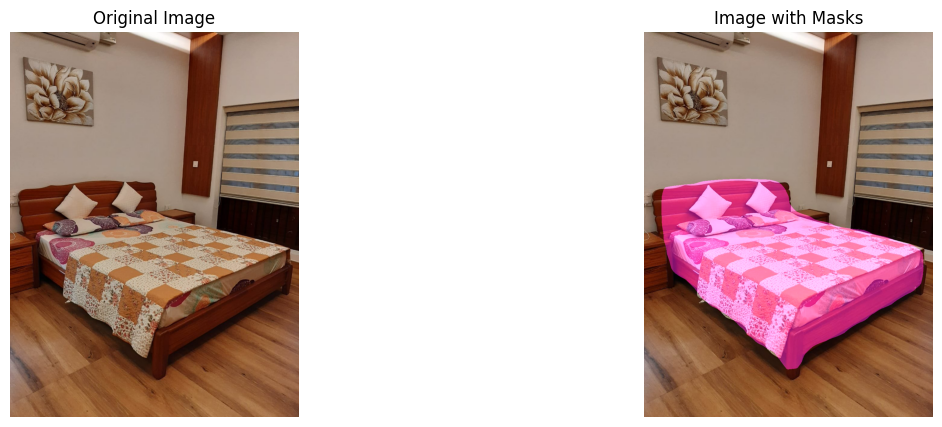
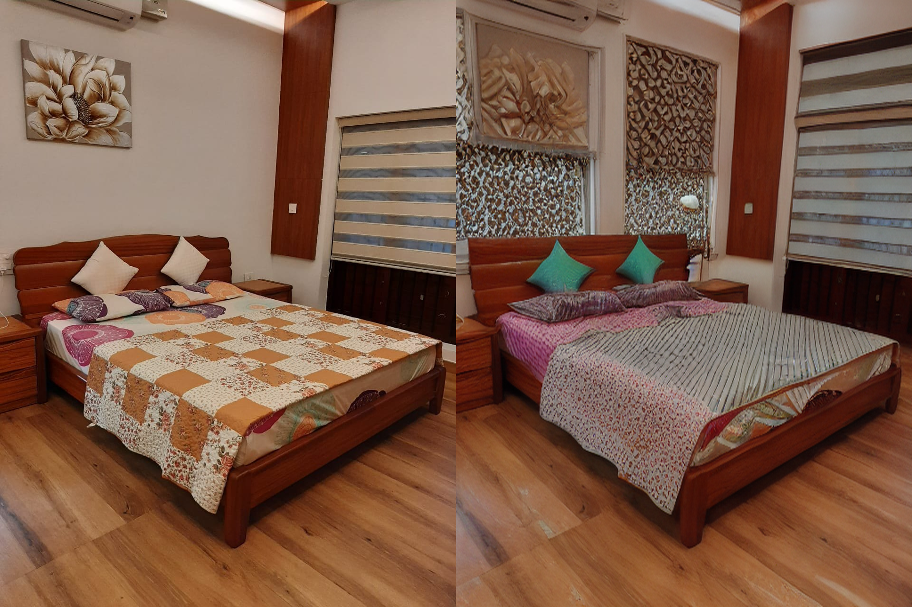

# R-CNN_Stable_Diffusion
AI-based image editing system} where users can upload images, generate masks using a pretrained Mask R-CNN model, and modify objects using a Stable Diffusion inpainting model

### User prompt example : "a pink colour bed with green pillow."

### Stable Diffusion inpainting

